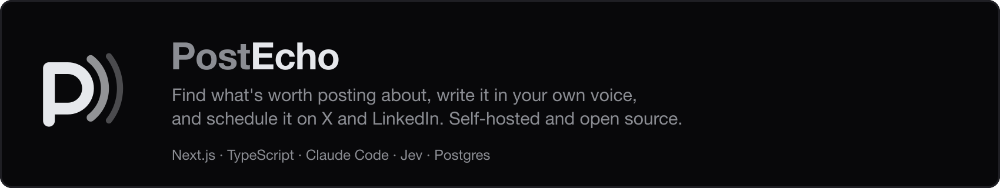
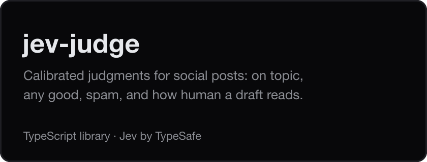
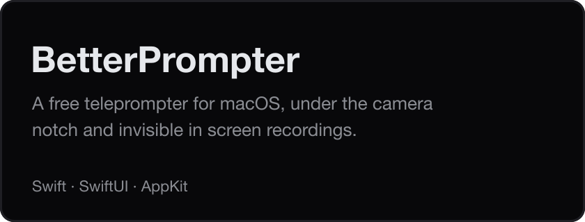

<picture>
  <source media="(prefers-color-scheme: dark)" srcset="assets/banner-dark.png">
  
</picture>

At [Forte AI](https://www.forte-ai.com) I lead product and design for **fMusic** and **fPost**, AI tools for
audio professionals. I prototype in code, with AI, so the team builds from something real. Most of that
code lives in Forte's private repositories, which is where the green squares come from.

## Open source

Some I build in my free time because I need them, like BetterPrompter, which I made to record my videos.
Others I build at work, for the company to use: PostEcho, and jev-judge, the library behind it.

  
  

## How I work

- **Take away before adding.** A busy screen is a bug.
- **Say each thing once,** in the interface and in the code.
- **Show the work while it happens.** Anything slow says what it's doing.
- **The product suggests, the person decides.** No nudges, no autopilot.

The [PostEcho case study](https://github.com/simojam93/postecho/blob/main/docs/case-study.md) shows them in
practice.

## Off the clock

I plan long cycling trips and build a website for each one, every time with a different stack, to learn
something new: [cycling-routes](https://github.com/simojam93/cycling-routes).

---

Open to conversations about product and design.
[LinkedIn](https://www.linkedin.com/in/simone-lovera/) · [X](https://x.com/lovera_simone) · [sl.simonelovera@gmail.com](mailto:sl.simonelovera@gmail.com)
